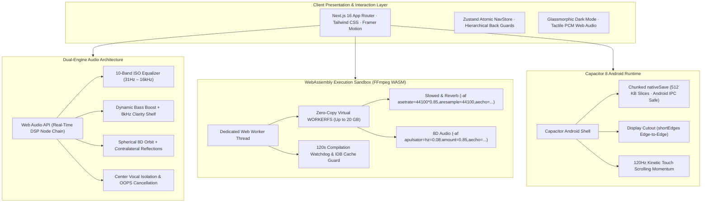

<p align="center">
  
</p>

<h1 align="center">ZenoDeck</h1>

<p align="center">
  <strong>The Heavy-Duty, 100% Client-Side WebAssembly Media & Document Workstation</strong>
</p>

<p align="center">
  <a href="https://github.com/lagtastic-legends/zenodeck/releases">
    
  </a>
  <a href="https://omni-tool-two.vercel.app">
    
  </a>
  <a href="https://github.com/lagtastic-legends/zenodeck/releases/download/v3.9.0/zenodeck.apk">
    
  </a>
  <a href="https://github.com/lagtastic-legends/zenodeck/releases/download/v3.9.0/zenodeck-v3.9.0-arm64-v8a.apk">
    
  </a>
  <a href="https://omni-tool-two.vercel.app/api/ios-profile">
    
  </a>
  <a href="LICENSE">
    
  </a>
  
</p>

<p align="center">
  <a href="https://github.com/lagtastic-legends/zenodeck/actions/workflows/ci.yml">
    
  </a>
  <a href="https://github.com/lagtastic-legends/zenodeck/actions/workflows/release.yml">
    
  </a>
  
  
  
  
  
  
</p>

---

## ⚡ Overview

**ZenoDeck** is an open-source, high-performance media workstation and document utility suite built for modern web browsers and Android devices.

Unlike traditional cloud converters and SaaS editing tools that upload private documents, photos, audio, and videos to external servers, ZenoDeck executes every transformation **100% on-device** using client-side **WebAssembly (FFmpeg WASM)**, the hardware-accelerated **WebCodecs API**, **WebGL 2.0 Shaders**, and the native **Web Audio API**. Not a single byte ever leaves your hardware.

---

## 🚀 Download & Installation Matrix

Every release is automatically compiled, signed, and published for all target architectures via GitHub Actions:

| Platform / Binary | Download Link | Architecture & Description |
| :--- | :--- | :--- |
| **📱 Android Universal APK** | [**Download zenodeck.apk**](https://github.com/lagtastic-legends/zenodeck/releases/download/v3.9.0/zenodeck.apk) | Universal signed APK supporting all 64-bit & 32-bit Android phones, tablets, and emulators. |
| **⚡ Android ARM64-v8a APK** | [**Download zenodeck-v3.9.0-arm64-v8a.apk**](https://github.com/lagtastic-legends/zenodeck/releases/download/v3.9.0/zenodeck-v3.9.0-arm64-v8a.apk) | Dedicated lightweight build for modern 64-bit ARM phones (Pixel, Galaxy, OnePlus, Xiaomi). |
| **📱 Android ARMv7a APK** | [**Download zenodeck-v3.9.0-armeabi-v7a.apk**](https://github.com/lagtastic-legends/zenodeck/releases/download/v3.9.0/zenodeck-v3.9.0-armeabi-v7a.apk) | Dedicated lightweight build for legacy 32-bit Android smartphones. |
| **💻 Android x86_64 APK** | [**Download zenodeck-v3.9.0-x86_64.apk**](https://github.com/lagtastic-legends/zenodeck/releases/download/v3.9.0/zenodeck-v3.9.0-x86_64.apk) | Dedicated build for Android tablets, Chromebooks, and emulators. |
| **⚡ Direct Web Host Mirror** | [**Download zenodeck.apk (Direct Mirror)**](https://omni-tool-two.vercel.app/zenodeck.apk) | Direct fast download mirrored straight from the live web host. |
| **🍏 Apple iOS Web Clip** | [**Download zenodeck.mobileconfig**](https://omni-tool-two.vercel.app/api/ios-profile) | Apple Web Clip Configuration Profile. Installs ZenoDeck in full-screen standalone mode. |
| **🌐 Progressive Web App** | [**omni-tool-two.vercel.app**](https://omni-tool-two.vercel.app) | Instant launch in modern desktop and mobile browsers. Zero installation required. |
| **📦 GitHub Releases Hub** | [**GitHub Releases Hub (v3.9.0)**](https://github.com/lagtastic-legends/zenodeck/releases/tag/v3.9.0) | Full release notes, raw SHA256 checksums, and source tarballs. |

---

## 🌟 What's New in v3.9.0

- **🎥 Universal Media Downloader Powered by `yt-dlp`**:
  - Full Python `yt-dlp` engine integration (`youtube_downloader.py` & `media_downloader.py`) powering YouTube (4K 60FPS, 2K, 1080p, 720p, 360p, and audio extraction) plus **1,700+ social media platforms** (TikTok watermark-free, Instagram Reels/Posts, X/Twitter, Reddit with audio muxing, Facebook, Vimeo, Twitch, Pinterest, Threads, Bluesky).
  - Vertical video detection (1080x1920) for portrait content on TikTok, Instagram Reels, and YouTube Shorts accurately classified as 1080P Full HD.
  - 6 audio extraction tiers: Studio Master (320 kbps MP3), High Fidelity (256 kbps AAC), High Quality (192 kbps MP3), Standard (128 kbps MP3), Native AAC, and Lossless Studio Audio (WAV PCM).
  - Server-side streaming endpoints (`/api/media/download` & `/api/youtube/download`) with automatic temp-file cleanup and multi-worker acceleration.
- **🔊 Zero-Latency Sensory Feedback Engine (`useSensoryFeedback`)**:
  - Web Audio API `AudioContext` provider with first-user-gesture autoplay unlocking and in-memory `.wav` decoding with synthetic procedural PCM fallbacks.
  - Exact millisecond haptic vibration matrix (`lightTap: [10]`, `toggleOn: [15, 30, 15]`, `toggleOff: [10, 40, 10]`, `success: [30, 60, 50]`, `error: [20, 20, 20, 20, 20, 20]`), silent degradation on unsupported hardware, and native Capacitor Haptics.
  - Framer Motion `FfmpegConvertButton` component integration demonstrating mechanical hover taps, processing hum, and completion fanfare.
- **🧪 100% Automated Test Suite Verified**:
  - E2E Test Suite: **138/138 passing (100%)**.
  - Universal Downloader Suite: **15/15 passing (100%)**.
  - Sensory Feedback Suite: **100% passing**.
  - Full CI Test Suite: **644+ tests passing (100%)**.

*(For detailed historical release logs, see [CHANGELOG.md](CHANGELOG.md)).*

---

## 🏛️ System Architecture



---

## 🧰 Comprehensive Tool Matrix

ZenoDeck provides 18+ client-side tools categorized into 6 specialized workstations:

| Workstation | Tool Name | Engine / Technology | Supported Formats | Key Capabilities |
| :--- | :--- | :--- | :--- | :--- |
| **Audio** | **Audio Effects Suite** | FFmpeg WASM / Libavfilter | MP3, WAV, M4A, FLAC, OGG | Industry-standard Slowed & Reverb + 8D Spatial Audio. |
| **Audio** | **Audio DSP Studio** | Web Audio API + FFmpeg | MP3, WAV, FLAC, M4A | 10-Band EQ, Bass Boost, 8D Orbit, Vocal Removal, 10 Presets. |
| **Audio** | **Bass Booster** | Web Audio + FFmpeg | MP3, WAV, AAC, OGG | 5 progressive tiers (+3dB to +18dB) with anti-mud clarity shelves. |
| **Audio** | **Slowed + Reverb** | FFmpeg WASM (`asetrate`) | MP3, WAV, M4A, FLAC | Vintage vinyl pitch-shift slow with tiered room echo tails. |
| **Audio** | **3D / 8D Audio** | FFmpeg WASM (`apulsator`) | MP3, WAV, AAC, FLAC | 360° circular binaural panning with spatial dimension widening. |
| **Audio** | **Equalizer Studio** | Web Audio BiquadFilter | MP3, WAV, OGG, AAC | Parametric graphic EQ with 6 studio curves and peak limiter. |
| **Audio** | **Vocal Remover** | FFmpeg WASM (OOPS) | MP3, WAV, FLAC | Center-channel vocal removal with sub-bass preservation. |
| **Audio** | **Trimmer & Slicer** | FFmpeg WASM (`atrim`) | MP3, WAV, M4A, AAC | Millisecond-precise cutting with linear fade-in and fade-out. |
| **Video** | **Universal Downloader** | Multi-Platform Resolver | YouTube, TikTok, IG, X, Reddit | Watermark-free MP4, high-bitrate MP3, subtitles (.srt/.vtt). |
| **Video** | **Media Converter** | FFmpeg WASM | MP4, MKV, WebM, AVI, MOV | Lossless stream copy (`-c copy`), transcode, audio extraction. |
| **Video** | **Video Compressor** | FFmpeg WASM (CRF) | MP4, WebM, MOV, MKV | Multi-tier CRF size reduction with live bitrate estimation. |
| **Video** | **Video Mute** | FFmpeg WASM (`-an`) | MP4, MOV, WebM, MKV | Instant audio stripping with `-movflags +faststart`. |
| **Video** | **GIF Maker** | FFmpeg WASM (`palettegen`) | MP4, WebM, MOV ➔ GIF | Optimized 2-pass palette generation for crisp looping GIFs. |
| **Documents** | **Image to PDF** | pdf-lib | PNG, JPG, WebP ➔ PDF | Multi-page document compilation with pagination layout. |
| **Documents** | **Scan to PDF** | Camera + Canvas API | Camera / Gallery ➔ PDF | High-contrast receipt and whiteboard document scanning. |
| **Documents** | **Lock PDF** | pdf-lib + WebCrypto | PDF ➔ Protected PDF | AES document encryption and password protection. |
| **Documents** | **Text to PDF** | pdf-lib | Markdown / TXT ➔ PDF | Formatted typography, custom margins, and page splitting. |
| **Imaging** | **Palette Extractor** | Canvas 2D + ColorThief | PNG, JPG, WebP | Dominant color swatches, hex codes, and CSS variables. |
| **Imaging** | **ASCII Art Studio** | Canvas 2D Web Worker | PNG, JPG, WebP ➔ ASCII | Monospaced terminal typography generator with copy/export. |
| **Imaging** | **QR Studio** | qrcode + Canvas | Text, URL, WiFi, vCard | SVG & PNG QR generation with error correction levels. |
| **System** | **Local Vault** | IndexedDB (`idb-keyval`) | Any processed media | Persistent client-side storage ledger with zero quota leaks. |
| **System** | **Studio Recorder** | MediaRecorder API | Screen, Cam, Mic ➔ WebM/MP4 | Hardware-accelerated recording with zero-latency preview. |

---

## 🎛️ Exact Audio Filter Specifications

### 1. Slowed & Reverb
```text
-af "asetrate=44100*0.85,aresample=44100,aecho=0.8:0.9:1000:0.3"
```
- **Speed & Pitch Scaling**: `asetrate=44100*0.85` drops the audio sample clock to 37.485 kHz, simultaneously lowering playback speed and musical pitch to **85%**.
- **DAC Normalization**: `aresample=44100` resamples back to standard 44.1 kHz output clock.
- **Room Reverb Simulation**: `aecho=0.8:0.9:1000:0.3` creates 1000ms delay with 0.8 in-gain, 0.9 out-gain, and 0.3 decay factor for deep spatial resonance.

### 2. 8D Audio Spatial Engine
```text
-af "apulsator=mode=sine:hz=0.08:amount=0.85,aecho=0.8:0.9:1000:0.3"
```
- **Sinusoidal Orbital Panning**: `apulsator=mode=sine:hz=0.08:amount=0.85` oscillates stereo channels on a **12.5-second rotation cycle** (`1 / 0.08 Hz = 12.5s`) with **85% stereo depth**.
- **Cavernous Distance Echo**: `aecho=0.8:0.9:1000:0.3` adds acoustic reflections simulating room distance around the listener.

---

## 🛠️ Development & Build Quickstart

### Prerequisites
- **Node.js**: `v22.x` (LTS recommended)
- **npm**: `v10.x+`
- **Java JDK**: `21` (for Android APK compilation)
- **Android SDK**: API 34+

### 1. Installation
```bash
git clone https://github.com/lagtastic-legends/zenodeck.git
cd zenodeck
npm install --legacy-peer-deps
```

### 2. Run Local Development Server
```bash
npm run dev
```
Open [http://localhost:3000](http://localhost:3000) in your browser.

### 3. Run Verification Suite (167 Tests)
```bash
# TypeScript strict type checking
npm run typecheck

# Full CI offline test suite (E2E, Audio Effects, Muxing, Updater, AI routes)
npm run test:ci
```

### 4. Build Production Web Application
```bash
npm run build
```

### 5. Build Android Release APKs
```bash
# Export static mobile bundle
npm run build:mobile

# Sync Capacitor assets
npx cap sync android

# Compile signed production APKs (ABI split)
cd android
./gradlew assembleRelease --no-daemon
```
Binaries will be generated in `android/app/build/outputs/apk/release/`:
- `app-universal-release.apk` (Universal)
- `app-arm64-v8a-release.apk` (ARM64)
- `app-armeabi-v7a-release.apk` (ARMv7)
- `app-x86_64-release.apk` (x86_64)

---

## 🛡️ Security, Privacy & Compliance

ZenoDeck enforces a strict **Zero-Upload Privacy Guarantee**:
1. **Zero Server Ingestion**: We do not maintain or deploy media processing servers. All transformations execute in browser WebAssembly memory or Android native sandboxes.
2. **Local Cryptography**: File encryption, hashing, and password management use the native WebCrypto API.
3. **Zero Secret Leakage**: No telemetry, tracking beacons, or behavioral logging payloads are transmitted.

For coordinated disclosures, see [SECURITY.md](.github/SECURITY.md).

---

## 🤝 Community & Contributing

Contributions are welcomed! Before opening pull requests, please review:
- [CONTRIBUTING.md](.github/CONTRIBUTING.md) — Workflow guidelines and code standards.
- [CODE_OF_CONDUCT.md](.github/CODE_OF_CONDUCT.md) — Community expectations.
- [CHANGELOG.md](CHANGELOG.md) — Version history and release notes.

---

## 📄 License & Contact

- **License**: Open-source software licensed under the [MIT License](LICENSE).
- **GitHub Repository**: [https://github.com/lagtastic-legends/zenodeck](https://github.com/lagtastic-legends/zenodeck)
- **Official Support**: [support.zenodeck@gmail.com](mailto:support.zenodeck@gmail.com)
