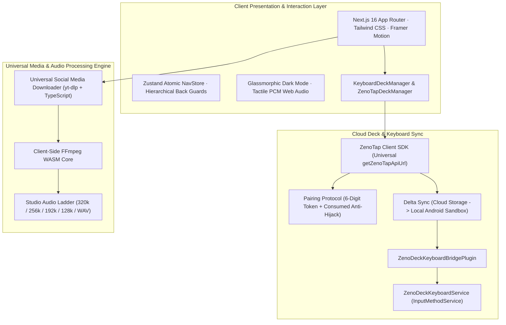

# 🚀 ZenoDeck Release Notes — v3.10.1

> **Cloud Deck & Keyboard Sync Subsystem Hardening & Professional GitHub Release**  
> *Release Date:* October 10, 2026  
> *Commit / Tag:* `v3.10.1`  
> *Architecture:* 100% Client-Side WebAssembly (WASM) + Capacitor 8 Android Shell + Node Serverless

---

## 🌟 Highlights of Release v3.10.1

### 1. ⚡ ZenoTap Cloud Deck & Keyboard Sync Subsystem Hardening
- **SQLite Pair Code Anti-Collision & Anti-Hijack Engine**:
  - Eliminated `UNIQUE constraint failed: zenotap_device_links.pair_code` crashes during device pair code generation.
  - Implemented pending-only query validation (`device_name IS NULL`), ensuring active paired rows cannot be overwritten or matched.
  - Pair codes are now atomically mutated to `consumed_<id>` upon confirmation, freeing up the 6-digit space for future pairings and permanently preventing session hijacking.
  - Added automated cleanup for stale unconfirmed codes and full device listing/unlinking lifecycle APIs.
- **Universal Mobile API URL Resolution (`getZenoTapApiUrl`)**:
  - Addressed native Android Capacitor WebViews (`https://localhost` / `capacitor://localhost`) by dynamically routing API calls to the production backend (`process.env.NEXT_PUBLIC_APP_URL || https://omni-tool-two.vercel.app`), preventing `ECONNREFUSED` connection failures.
  - Stripped trailing slashes across all endpoints (`/upload-ticket`, `/upload`, `/deck`, `/device/pair`, `/sync`), preventing Next.js App Router 308 permanent redirect payload and authorization header stripping.
- **CORS Preflight (`OPTIONS`) & Response Attestation on All Endpoints**:
  - Implemented standard `OPTIONS` handlers and universal `zenoTapResponse` headers across all 5 ZenoTap API routes, allowing cross-origin requests from mobile WebViews without browser CORS blocks.
- **Cleartext HTTP Policy Protection on Android**:
  - Enforced HTTPS download URLs on production environments in `/api/zenotap/v1/sync`, preventing Android 9+ `CLEARTEXT communication not permitted` network security exceptions.
- **Capacitor Asset Scheme Thumbnail Fix**:
  - Replaced hardcoded `capacitor://localhost/_capacitor_file_` with `Capacitor.convertFileSrc(path)`, ensuring thumbnails render seamlessly under Android's configured `androidScheme: "https"`.

### 2. 🔄 Full Delta Cloud-to-Local Keyboard Deck Synchronization
- **Automated Media Synchronization (`syncCloudDeckToLocal`)**:
  - Built an automated delta synchronization function that queries cloud deck items (via Bearer `syncToken` or active user account), compares filenames and byte sizes against local storage (`getKeyboardDeckGifs`), and downloads missing GIFs directly to the Android internal storage sandbox (`filesDir/zenodeck_gifs`).
  - Broadcasts `ACTION_DECK_UPDATED` upon completion so the Android InputMethodService (`ZenoDeckKeyboardService`) immediately re-renders its RecyclerView media grid.
- **Interactive Companion Device Pairing & Sync UI**:
  - Upgraded both `KeyboardDeckManager` and `ZenoTapDeckManager` with interactive 6-digit code entry for companion linking, live sync progress badges, and 1-click "Sync Cloud" actions.

### 3. 🌐 Universal Multi-Platform Social Media Video & Audio Downloader
- **Comprehensive Platform Coverage**: Dedicated analyzers and metadata extractors for **TikTok** (watermark-free 1080p/720p), **Instagram** (Reels, Posts, IGTV), **Twitter / X** (with public syndication and multi-provider failover), **Reddit** (v.redd.it with DASH audio extraction and muxing), **Facebook** (Reels, Watch, videos), **Vimeo** (direct progressive MP4 configs bypassing login restrictions), and **Pinterest** (pins & pin.it video links).
- **Universal Studio Audio Ladder**: Automatic synthesis of 5 direct studio audio tiers for every social video:
  - `320 kbps MP3` (Studio Master)
  - `256 kbps AAC / M4A` (High Fidelity)
  - `192 kbps MP3` (High Quality)
  - `128 kbps MP3` (Standard Audio)
  - `WAV PCM` (Lossless Studio Audio)
- **Client-Side FFmpeg WebAssembly Demuxing**: Downloader executes real client-side FFmpeg audio extraction (`-vn -b:a 320k`, etc.) when audio formats are selected, eliminating corrupt or mislabeled video-as-audio downloads.
- **Platform-Aware Referer Injection on CDN Stream Proxies**: Upgraded `/api/youtube/stream` and `/api/media/download` to inject origin-specific `Referer` headers for TikTok, Instagram, Twitter, Reddit, Facebook, Vimeo, and Pinterest CDNs, permanently eliminating upstream HTTP 403 Forbidden errors.

---

## 🧪 Quality & Verification Matrix

| Test Suite / Gate | Coverage | Result | Execution Time |
| :--- | :--- | :--- | :--- |
| **TypeScript Strict Validation** | All Project Files (`tsc --noEmit`) | **0 Errors** | ~5s |
| **Next.js Production Build** | Static & Dynamic Route Compilation (`next build`) | **17 / 17 Pages Built** | ~25s |
| **ZenoTap Security Test Suite** | HMAC, Nonce Anti-Replay, Magic-Byte, DB Isolation, Anti-Hijack | **8 / 8 (100%)** | ~2s |
| **ZenoTap Sync & Pairing Suite** | URL Normalization, CORS, Bearer Sync, Device Isolation | **4 / 4 (100%)** | ~2s |
| **Comprehensive E2E Suite** | Feature, Boundary, Combinations, Scenarios | **138 / 138 (100%)** | ~6s |
| **Multi-Platform Downloader Suite** | YouTube, TikTok, IG, X, Reddit, FB, Vimeo, Pinterest | **36 / 36 (100%)** | ~2s |
| **Studio-Grade DSP Suite** | All 13 Tools, 8 Reverb Spaces, Fast-Paths | **162 / 162 (100%)** | ~45ms |
| **Audio Effects Engine Tests** | Slowed & Reverb, 8D Audio, UI Components | **37 / 37 (100%)** | ~3ms |
| **App Updater & Semver Suite** | Semver Comparisons & Cache Invalidation | **12 / 12 (100%)** | ~12ms |
| **AI Route & CORS Architecture** | Mobile/Web Endpoint Resolution, CORS | **PASS (100%)** | ~8ms |

---

## 📱 Binary Downloads & Installation

| Platform / Binary | Download Link | Description |
| :--- | :--- | :--- |
| **📱 Android Universal APK** | [**Download zenodeck.apk**](https://github.com/lagtastic-legends/zenodeck/releases/download/v3.10.1/zenodeck.apk) | Universal signed APK supporting all 64-bit & 32-bit Android devices. |
| **⚡ Android ARM64-v8a APK** | [**Download zenodeck-v3.10.1-arm64-v8a.apk**](https://github.com/lagtastic-legends/zenodeck/releases/download/v3.10.1/zenodeck-v3.10.1-arm64-v8a.apk) | Dedicated lightweight build for modern 64-bit ARM phones. |
| **📱 Android ARMv7a APK** | [**Download zenodeck-v3.10.1-armeabi-v7a.apk**](https://github.com/lagtastic-legends/zenodeck/releases/download/v3.10.1/zenodeck-v3.10.1-armeabi-v7a.apk) | Dedicated build for legacy 32-bit Android smartphones. |
| **💻 Android x86_64 APK** | [**Download zenodeck-v3.10.1-x86_64.apk**](https://github.com/lagtastic-legends/zenodeck/releases/download/v3.10.1/zenodeck-v3.10.1-x86_64.apk) | Dedicated build for Android tablets, Chromebooks, and emulators. |
| **⚡ Direct Web Host Mirror** | [**Download zenodeck.apk (Direct Mirror)**](https://omni-tool-two.vercel.app/zenodeck.apk) | Direct fast download mirrored straight from the live web host. |
| **🍏 Apple iOS Web Clip** | [**Download zenodeck.mobileconfig**](https://omni-tool-two.vercel.app/api/ios-profile) | Apple Web Clip Configuration Profile. Installs ZenoDeck in full-screen standalone mode. |
| **🌐 Progressive Web App** | [**omni-tool-two.vercel.app**](https://omni-tool-two.vercel.app) | Instant launch in modern desktop and mobile browsers. Zero installation required. |
| **📦 GitHub Releases Hub** | [**GitHub Releases Hub (v3.10.1)**](https://github.com/lagtastic-legends/zenodeck/releases/tag/v3.10.1) | Full release notes, raw SHA256 checksums, and source tarballs. |

---

## 🏛️ System Architecture

